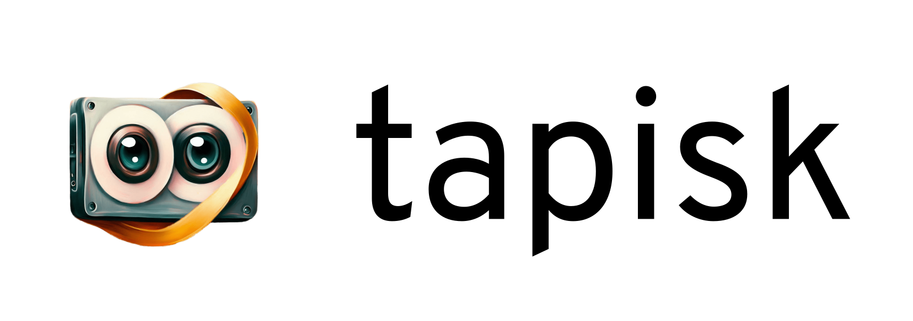

# tapisk



Expose a tape drive as a block device.

## Overview

🚧 This project is a work-in-progress! Instructions will be added as soon as it is usable. 🚧

## Contributing

To contribute, please use the [GitHub flow](https://guides.github.com/introduction/flow/) and follow our [Code of Conduct](./CODE_OF_CONDUCT.md).

To build and start a development version of tapisk locally, run the following:

```shell
$ git clone https://github.com/pojntfx/tapisk.git
$ cd tapisk

# If you have a tape library
$ lsscsi -g # Find your tape library (`/dev/sgX`)
$ mtx -f /dev/sg4 status
$ mtx -f /dev/sg4 load 1 # Load a tape into your drive

$ lsscsi -g # Find your tape drive (`/dev/nstX`)
$ mt -f /dev/nst3 status
$ sudo mt -f /dev/nst3 stsetoptions scsi2logical # Enable the `tell` syscall on your tape drive
$ mt -f /dev/nst3 setblk 4096 # Set the block size
$ mt -f /dev/nst3 rewind
$ mt -f /dev/nst3 weof # Erase the tape
$ mt -f /dev/nst3 rewind

$ rm -f /tmp/tapisk.db && go run ./cmd/tapisk --dev /dev/nst3 --index /tmp/tapisk.db # Start the NBD server

# In another terminal (you can also use the `nbd-client` command from your distribution)
$ go install github.com/pojntfx/go-nbd/cmd/go-nbd-example-client@latest
$ sudo umount ~/Downloads/mnt; sudo $(which go-nbd-example-client) --file /dev/nbd1 # Start the NBD client (make sure you have the `nbd` module loaded)

# In another terminal
$ sudo mkfs.ext4 /dev/nbd1 # Format the tape
$ sudo time sync -f ~/Downloads/mnt; sudo umount ~/Downloads/mnt; sudo rm -rf ~/Downloads/mnt && sudo mkdir -p ~/Downloads/mnt && sudo mount /dev/nbd1 ~/Downloads/mnt && sudo chown -R "${USER}" ~/Downloads/mnt # Mount the tape to ~/Downloads/mnt

$ cat ~/Downloads/mnt/test; echo "Current date: $(date)" | tee ~/Downloads/mnt/test && cat ~/Downloads/mnt/test; sync -f ~/Downloads/mnt/test # Test the filesystem by reading & writing the current date to a file
```

Have any questions or need help? Chat with us [on Matrix](https://matrix.to/#/#tapisk:matrix.org?via=matrix.org)!

## License

tapisk (c) 2023 Felicitas Pojtinger and contributors

SPDX-License-Identifier: AGPL-3.0
